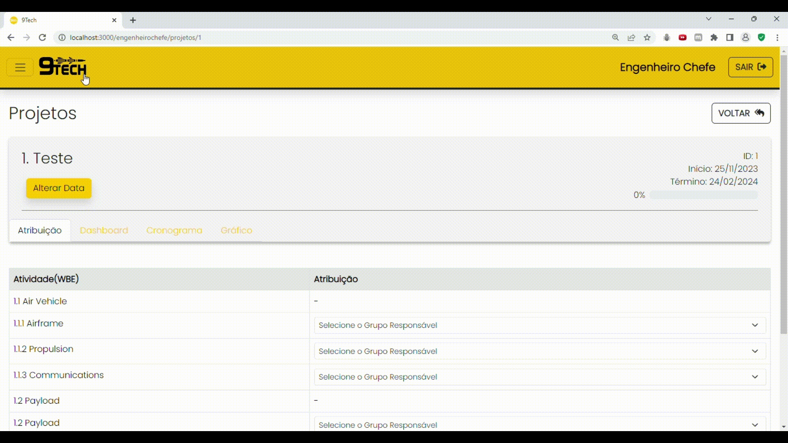

<h1>Portifólio APIs - Vitor Garcez de Oliveira</h1>

  

<h2>Meus projetos</h2>
<h2>Spicecorp - Internet Banking</h2>

  

<h3>Spicebank</h3>
<h4>2022.2</h4>

Parceiro Acadêmico: <a href="https://fatecsjc-prd.azurewebsites.net/">Faculdade de Tecnologia de São José dos Campos</a>

:warning: **Problema:**

A crescente digitalização dos serviços bancários trouxe consigo desafios significativos, especialmente no que diz respeito à ausência de sistemas eficazes para Internet Banking. A dificuldade reside na necessidade de proporcionar experiências adequadas aos usuários, uma vez que processos tradicionalmente realizados presencialmente, como transferências, consultas de saldo e pagamentos, tornam-se mais complexos sem uma plataforma digital integrada.

:heavy_check_mark: **Proposta de Solução:**

Foi desenvolvido um sistema abrangente para o gerenciamento de transações em um banco digital fictício. Esta solução foi concebida com o objetivo de monitorar e controlar eficientemente as operações bancárias, priorizando a redução das interações presenciais. O sistema proporciona uma abordagem integrada e automatizada, melhorando a eficácia operacional e oferecendo uma experiência mais eficiente e segura para os usuários.

  

<h3>Tecnologias Utilizadas</h3>

- Python - Linguagem de Programação utilizada no backend
- Flask - Framework utilizado no desenvolvimento web
- HTML/CSS - Linguagens de marcação e estilo utilizadas no frontend
- MariaDB -  SGBD utilizado para o armazenamento dos dados
- Figma - Plataforma utilizada para desenvolvimento e prototipação de wireframes

<h3>Contribuições Pessoais</h3>

<h3>Lições Aprendidas</h3>

<h3>Hard Skills</h3>

<h3>Soft Skills</h3>

 Proatividade:

<h2>Tswift - ERP de Inspeção de entrada para controle de recebimento de grãos</h2>

  

<h4>2023.1</h4>

Parceiro Acadêmico: <a href="https://www.jaia.software">Jaia Software</a>

:warning: **Problema:**

Diante das demandas crescentes do setor agroindustrial e da necessidade de otimizar o controle de recebimento de grãos, identificou-se a carência de um sistema eficiente para gerenciar o processo de entrada e inspeção de mercadorias. A ausência de uma solução dedicada compromete a agilidade, segurança e transparência nas operações, dificultando o acompanhamento em tempo real do status de entrega e a gestão adequada das transações comerciais.

:heavy_check_mark: **Proposta de Solução:**

Foi desenvolvido um sistema de inspeção de entrada para o controle efetivo do recebimento de grãos no ambiente agroindustrial. O projeto oferece três perfis de usuários distintos (administrativo, operacional e gerencial), proporcionando funcionalidades de cadastro de usuários, produtos e transportadoras para garantir a organização e gestão eficaz das informações. Além disso, a implementação de perfis de acesso específicos assegura a segurança das operações. O sistema, de forma prática, registra a entrada de mercadorias, conduz inspeções de qualidade, e disponibiliza relatórios gerenciais para facilitar o acompanhamento e análise dos dados, promovendo eficiência e controle no processo de recebimento de grãos.

  

<h3>Tecnologias Utilizadas</h3>

- Typescript - Linguagem de Programação utilizada no backend
- React - Biblioteca JavaScript utilizada no desenvolvimento frontend.
- Vite.js - Ferramenta de desenvolvimento (bundler) utilizada no React
- Mysql -  SGBD utilizado para o armazenamento dos dados
- Figma - Plataforma utilizada para desenvolvimento e prototipação de wireframes

<h3>Contribuições Pessoais</h3>

<h3>Lições Aprendidas</h3>

<h3>Hard Skills</h3>

<h3>Soft Skills</h3>

 :

<h2>NineTech - Software de Gestão de Projetos Complexos</h2>

  

<h4>2023.2</h4>

Parceiro Acadêmico: <a href="https://www.siatt.com.br/siatt/">SIATT</a>

:warning: **Problema:**

Diante das demandas crescentes do setor agroindustrial e da necessidade de otimizar o controle de recebimento de grãos, identificou-se a carência de um sistema eficiente para gerenciar o processo de entrada e inspeção de mercadorias. A ausência de uma solução dedicada compromete a agilidade, segurança e transparência nas operações, dificultando o acompanhamento em tempo real do status de entrega e a gestão adequada das transações comerciais.

:heavy_check_mark: **Proposta de Solução:**

Foi desenvolvido um sistema de inspeção de entrada para o controle efetivo do recebimento de grãos no ambiente agroindustrial. O projeto oferece três perfis de usuários distintos (administrativo, operacional e gerencial), proporcionando funcionalidades de cadastro de usuários, produtos e transportadoras para garantir a organização e gestão eficaz das informações. Além disso, a implementação de perfis de acesso específicos assegura a segurança das operações. O sistema, de forma prática, registra a entrada de mercadorias, conduz inspeções de qualidade, e disponibiliza relatórios gerenciais para facilitar o acompanhamento e análise dos dados, promovendo eficiência e controle no processo de recebimento de grãos.

  

<h3>Tecnologias Utilizadas</h3>

- Java/Spring - Linguagem de Programação utilizada no backend
- React - Biblioteca JavaScript utilizada no desenvolvimento frontend.
- Vite.js - Ferramenta de desenvolvimento (bundler) utilizada no React
- Mysql -  SGBD utilizado para o armazenamento dos dados
- Figma - Plataforma utilizada para desenvolvimento e prototipação de wireframes

<h3>Contribuições Pessoais</h3>

<h3>Lições Aprendidas</h3>

<h3>Hard Skills</h3>

<h3>Soft Skills</h3>

 :

